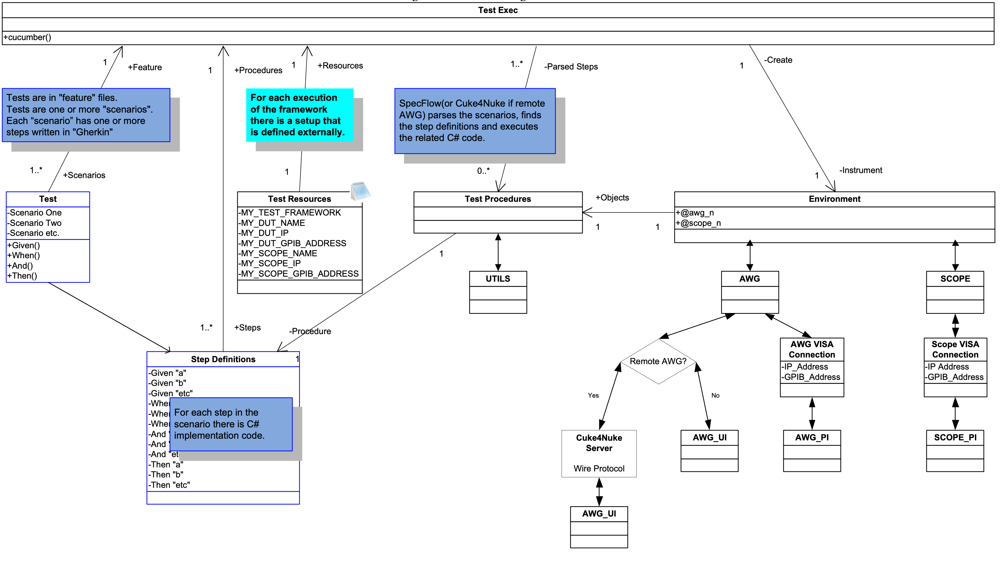
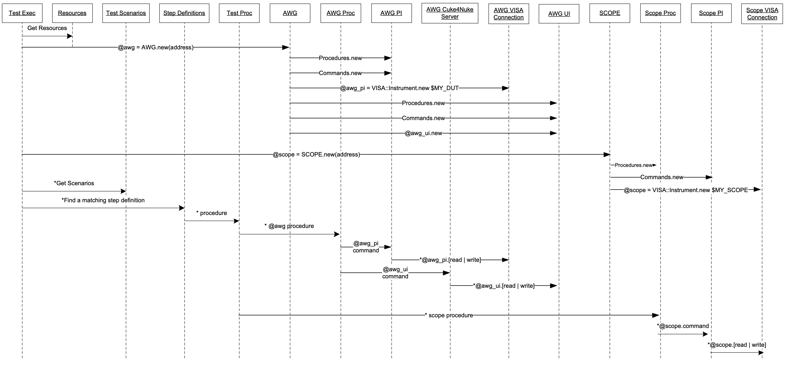

# Test Framework Design

## Overview
This documentation supports the design for the Test Automation Framework for AWGs based on SpecFlow and C#. It is based upon earlier work done for the Kepler-class instruments in Ruby/Cucumber.
The actors in the Test Framework have been identified, roles defined, and functional comparisons with the older system are shown in Table 1.
The “Test Exec” role is being played by “SpecFlow”.  SpecFlow is a port of the functionality delivered in Ruby/Cucumber to C# and VisualStudio. 
Cucumber is an… 

## Execution Structure and Flow
The test begins when SpecFlow generated a code-behind C# file from the *.feature text.
SpecFlow then parses the generated C# feature file, which consists of features, scenarios and steps.  

Steps are the textual descriptions which form the body of a Scenario. One or more Scenarios are included in a Feature (which is essentially one test case).
When the SpecFlow finds a reserved keyword in a line (Given, When, And or Then), then it is considered a step and uses the rest of the line to find the Step Definition by matching the text of the line to regular expressions in the step definition file(s).
Once a match has been found, then C# statements in the Step Definition are executed.  

The Step Definitions are the inward facing feature of SpecFlow’s execution of *.feature files. A step definition is analogous to a method definition or function definition in any kind of OO/procedural programming language. Step definitions can take 0 or more arguments, identified by groups in the regular expression (and an equal number of arguments).
In the case of UI steps, the White Automation Library is used to abstract and extend the Windows UIAutomation library and Windows messaging systems, making the development of UI steps easier. The framework will continue to use the White library.  

When the UI under test is local to the test environment, SpecFlow and the White Automation Library can access the UI components directly.
Communications with a remote AWG UI are handled by the Cuke4Nuke Ruby Gem and its embedded Wire Protocol server, which works outside the scope of VISA communications. We will compile the VS2010 C# project using the CUKE4NUKE switch, export the resulting DLL assembly to the remote AWG and then the Wire Protocol and Cuke4Nuke server running on the remote AWG handle the UI communications interface.

## The Gherkin Test Script Language
The features/scenarios/steps are written in Gherkin language as seen in the following source file.
```
 1: Feature: Some terse yet descriptive text of what is desired
 2:   In order to realize a named business value
 3:   As an explicit system actor
 4:   I want to gain some beneficial outcome which furthers the goal
 5: 
 6:   Scenario: Some determinable business situation
 7:     Given some precondition
 8:       And some other precondition
 9:     When some action by the actor
10:       And some other action
11:       And yet another action
12:     Then some testable outcome is achieved
13:       And something else we can check happens too
14: 
15:   Scenario: A different situation
16:       ...
```
The first line of the Gherkin source file starts the feature. Lines 2-4 are unparsed text, which is expected to describe the business value of this feature.  The text is unparsed until it finds the keyword Scenario.  Line 6 starts a scenario.  Lines 7-13 are the steps for the scenario.  Line 15 starts next scenario and so on.

## Actors, Roles and Responsibilities

### Table 1

| Actor                               | Role                                                                                                                                                                                                                                                                                                                                                                                                                   | Responsibilities                                                                                                                                                                                                                                                                                                                    |
|-------------------------------------|------------------------------------------------------------------------------------------------------------------------------------------------------------------------------------------------------------------------------------------------------------------------------------------------------------------------------------------------------------------------------------------------------------------------|-------------------------------------------------------------------------------------------------------------------------------------------------------------------------------------------------------------------------------------------------------------------------------------------------------------------------------------|
| Test Exec (SpecFlow)                | Parse UTC as defined in Gherkin text into steps, manages the steps and records responses such as pass/fail                                                                                                                                                                                                                                                                                                             | - Creates   - Environment   - Parse Steps   - Executes Steps   - Logging responses                                                                                                                                                                                                                                                  |
| Test Agent (Cuke4Nuke)              | Ruby Gem, passes UI traffic over Wire Protocol to remote AWG running Cuke4Nuke Server and compiled DLL assembly of step definitions.                                                                                                                                                                                                                                                                                   | - Communicates with remote UI application    - Acts on remote UI objects   - Returns requested property values from remote UI objects                                                                                                                                                                                               |
| Tests (Scenarios in Gherkin text)   | Contain a series of steps to test the AWG UI and/or PI functionality                                                                                                                                                                                                                                                                                                                                                   | - Defined by the user for specific tests   - Knows correct responses                                                                                                                                                                                                                                                                |
| App.config                          | C# UI Object Map file. Sets globally available constant values to AutomationID or other object recognition method in UI application.                                                                                                                                                                                                                                                                                   | - Simple XML key/value pairs that are used to map a constant to the current and correct object recognition string for a UI control or other object.                                                                                                                                                                                 |
| Compound Step Definitions (C# code) | Higher level functionality using one or more AWG PI commands or UI operations. Typically, these will be “compound steps” consisting of a number of lower level step definitions that accomplish a given task. The procedures will be segregated (where practical) by type (UI, PI) and functional area. These form the “catalog” of higher-level common operations developers and others will use to build test cases. | - Knows how to use all of the AWG and Scope procedures (High and Low, UI, PI and IPI)   - Knows about Pass/Fail of tests   - Knows how to use the lower level AWG UI or PI steps to implement complex functions such as load and run waveforms, check for errors, etc.   - Knows about expected and unexpected errors from commands |
| Step Definitions (C# code)          | Higher level functionality invoking one or more AWG PI and Scope PI commands or AWG UI operations. Collections of these build up the Compound Steps above. These form the “catalog” of individual steps developers and others will use to build test cases.                                                                                                                                                            | - Knows how to use the AWG PI and IPI to implement high level functions such as loading waveforms, getting contents of the error queue, etc.   - Knows how to access the AWG UI to implement functions such as button presses, text box values, and window/dialog manipulations.                                                    |
| AWG Low UI Procedures               | Low level functionality abstracting single AWG UI operations into a Gherkin step.                                                                                                                                                                                                                                                                                                                                      | - Consists of the base-level abstractions of UI operations that accomplish a single task, for example setting a value in a text box or clicking a button   - Knows about expected and unexpected errors from commands                                                                                                               |
| AWG Low PI Procedures               | Low level functionality abstracting single AWG PI commands into a Gherkin step. Typically, these will be simple operations that accomplish a single task or operation that can be built into more complex compound steps. Also segregated by functional area.                                                                                                                                                          | - Consists of the base-level abstractions of PI commands that accomplish a single task, for example setting a value or returning the results of a query   - Knows about expected and unexpected errors from commands                                                                                                                |
| AWG PI Commands                     | Given a VISA connection, it properly generates commands and queries for the SCPI programmatic interface (PI). Also segregated by functional area.                                                                                                                                                                                                                                                                      | - Properly formats commands and queries.   - Not responsible for accuracy of parameters passed                                                                                                                                                                                                                                      |
| AWG Connection                      | Initiates and maintains VISA sessions to instruments and PC’s in the test environment                                                                                                                                                                                                                                                                                                                                  | - VISA session open/close .  - VISA writes, reads, errors, timeouts                                                                                                                                                                                                                                                                 |
| Scope Procedures                    | Higher level functionality using one or more scope PI commands.                                                                                                                                                                                                                                                                                                                                                        | - Knows how to use the scope PI to implement functions such as capturing waveforms and performing analysis   - Knows about errors                                                                                                                                                                                                   |
| Scope PI Commands                   | Given a VISA connection, it properly generates commands and queries                                                                                                                                                                                                                                                                                                                                                    | - Properly formats commands and queries.   - Not responsible for accuracy of parameters passed                                                                                                                                                                                                                                      |
| Timers                              | Start, Stop, Elapsed time                                                                                                                                                                                                                                                                                                                                                                                              | - Starts a timer   - Stops a timer   - Returns elapsed times                                                                                                                                                                                                                                                                        |
| Utilities                           | File management, file comparisons                                                                                                                                                                                                                                                                                                                                                                                      | - Checks directories for specified files, copies files or groups of files to/from the DUT’s   - Compares files against gold masters                                                                                                                                                                                                 |
| Test Resources                      | User specific discovery and setup of test environment.                                                                                                                                                                                                                                                                                                                                                                 | - Reads config file or requests user input to define test environment. - Confirms presence of requested assets. - Has definition for all resources used in one or more tests                                                                                                                                                        |
| Environment                         | Contains instrument identifiers, IP addresses, etc.                                                                                                                                                                                                                                                                                                                                                                    | - Creates AWG and Scope device objects based on “Test Resources” - Holds specific instrument profiles - Holds specific user profiles e.g. paths                                                                                                                                                                                     |
 
## Class Comparisons
The following table shows the currently defined classes in the Ruby-based Kepler AWG Test Framework and the proposed corresponding C# classes for the 
AWG Test Framework. In Ruby, modules are similar to C# base classes, but modules can hold classes that hold modules – it can get a bit convoluted if you are not careful. The main intent here is to show that for each AWG, and PC in the test system, instances of PI and UI communications sessions and data need to be maintained, and how there are a few shared classes of utility functions that contribute to higher level procedures for each type of device in the test environment.  In addition, a given test session will need to maintain a single SCOPE PI communications session. 

*NOTE:* Empty blocks represent command groups that are not listed as being required for backward compatibility, and are TBD.

| Module   | Class::module                      | Role                                                                                                                                                                                                                                                          | Class      | Inherits From                          |
|----------|------------------------------------|---------------------------------------------------------------------------------------------------------------------------------------------------------------------------------------------------------------------------------------------------------------|------------|----------------------------------------|
| AWG_PI   | AWG                                | AWG system state variables, initialization, VISA session management.                                                                                                                                                                                          | AWG        | AWG_PI, AWG_UI, AWG_Proc               |
| AWG_PI   | Procedures                         | Query and command execution, some helper functions                                                                                                                                                                                                            | AWG_Proc   | UTILS                                  |
| AWG_PI   | AWG::CalCommands                   | Calibration group command definitions                                                                                                                                                                                                                         |            |                                        |
| AWG_PI   | AWG::ControlCommands               | AWG Control group command definitions                                                                                                                                                                                                                         | AWG_PI     | ControlCommands                        |
| AWG_PI   | AWG::DiagnosticCommands            | Diagnostic group command definitions                                                                                                                                                                                                                          | AWG_PI     | DiagnosticCommands                     |
| AWG_PI   | AWG::DisplayCommands               | Display group command definitions                                                                                                                                                                                                                             |            |                                        |
| AWG_PI   | AWG::EventCommands                 | Event group command definitions                                                                                                                                                                                                                               | AWG_PI     | EventCommands                          |
| AWG_PI   | AWG::InstrumentCommands            | Instrument group command definitions                                                                                                                                                                                                                          |            |                                        |
| AWG_PI   | AWG::MassMemoryCommands            | Mass Memory group command definitions                                                                                                                                                                                                                         | AWG_PI     | MassMemoryCommands                     |
| AWG_PI   | AWG::OutputCommands                | Output group command definitions                                                                                                                                                                                                                              | AWG_PI     | OutputCommands                         |
| AWG_PI   | AWG::SequenceCommands              | Sequence group command definitions                                                                                                                                                                                                                            | AWG_PI     | SequenceCommands                       |
| AWG_PI   | AWG::SubsequenceCommands           | Subsequence group command definitions                                                                                                                                                                                                                         | AWG_PI     | SubsequenceCommands                    |
| AWG_PI   | AWG::SourceCommands                | Source group command definitions                                                                                                                                                                                                                              | AWG_PI     | SourceCommands                         |
| AWG_PI   | AWG::StatusCommands                | Status group command definitions                                                                                                                                                                                                                              | AWG_PI     | StatusCommands                         |
| AWG_PI   | AWG::SyncCommands                  | Synchronization group command definitions                                                                                                                                                                                                                     | AWG_PI     | SyncCommands                           |
| AWG_PI   | AWG::SystemCommands                | System group command definitions                                                                                                                                                                                                                              | AWG_PI     | SystemCommands                         |
| AWG_PI   | AWG::TriggerCommands               | Trigger group command definitions                                                                                                                                                                                                                             | AWG_PI     | TriggerCommands                        |
| AWG_PI   | AWG::WaveformCommands              | Waveform group command definitions                                                                                                                                                                                                                            | AWG_PI     | WaveformCommands                       |
|          |                                    | NOTE: Work in the UI portion of the Kepler framework has been very limited, the classes listed below represent future work – not actual existing classes                                                                                                      |            |                                        |
| AWG_UI   | AWG                                | AWG UI system state variables, initialization. NOTE: The AWG sub-class was used in anticipation of multiple AWG’s in a given test environment. The same conditions are assumed for Pascal. Multiple UI communication sessions are an unresolved design issue. |            |                                        |
| AWG_UI   | AWG::MainWindow                    |                                                                                                                                                                                                                                                               | AWG_UI     | AWG_Proc, UTILS, Others(TBD)           |
| AWG_UI   | AWG::MenuBar                       |                                                                                                                                                                                                                                                               |            |                                        |
| AWG_UI   | AWG::StatusBar                     |                                                                                                                                                                                                                                                               |            |                                        |
| AWG_UI   | AWG::WaveformWindow                |                                                                                                                                                                                                                                                               |            |                                        |
| AWG_UI   | AWG::SettingsWindow                |                                                                                                                                                                                                                                                               |            |                                        |
| AWG_UI   | AWG::ImportFromFileDialog          |                                                                                                                                                                                                                                                               |            |                                        |
| AWG_UI   | AWG::ImportFromScopeDialog         |                                                                                                                                                                                                                                                               |            |                                        |
| AWG_UI   | AWG::ExportWfmToFileDialog         |                                                                                                                                                                                                                                                               |            |                                        |
| AWG_UI   | AWG::CreateAnalogWfmDialog         |                                                                                                                                                                                                                                                               |            |                                        |
| AWG_UI   | AWG::CreateDigitalPatternDialog    |                                                                                                                                                                                                                                                               |            |                                        |
| AWG_UI   | AWG::EquationEditorDialog          |                                                                                                                                                                                                                                                               |            |                                        |
| AWG_UI   | AWG::CutDialog                     |                                                                                                                                                                                                                                                               |            |                                        |
| AWG_UI   | AWG::CopyDialog                    |                                                                                                                                                                                                                                                               |            |                                        |
| AWG_UI   | AWG::InsertWfmDialog               |                                                                                                                                                                                                                                                               |            |                                        |
| AWG_UI   | AWG::DeleteDialog                  |                                                                                                                                                                                                                                                               |            |                                        |
| AWG_UI   | AWG::RenameDialog                  |                                                                                                                                                                                                                                                               |            |                                        |
| AWG_UI   | AWG::SequenceControlParamsDialog   |                                                                                                                                                                                                                                                               |            |                                        |
| AWG_UI   | AWG::InsertSubsequenceDialog       |                                                                                                                                                                                                                                                               |            |                                        |
| AWG_UI   | AWG::SetSubsequenceDialog          |                                                                                                                                                                                                                                                               |            |                                        |
| AWG_UI   | AWG::NameSubsequenceDialog         |                                                                                                                                                                                                                                                               |            |                                        |
| AWG_UI   | AWG::InvertDialog                  |                                                                                                                                                                                                                                                               |            |                                        |
| AWG_UI   | AWG::ShiftRotateDialog             |                                                                                                                                                                                                                                                               |            |                                        |
| AWG_UI   | AWG::ScaleDialog                   |                                                                                                                                                                                                                                                               |            |                                        |
| AWG_UI   | AWG::OffsetDialog                  |                                                                                                                                                                                                                                                               |            |                                        |
| AWG_UI   | AWG::WfmPropertiesDialog           |                                                                                                                                                                                                                                                               |            |                                        |
| AWG_UI   | AWG::GoToDialog                    |                                                                                                                                                                                                                                                               |            |                                        |
| AWG_UI   | AWG::DisplayPropertiesDialog       |                                                                                                                                                                                                                                                               |            |                                        |
| AWG_UI   | AWG::CouplingDialog                |                                                                                                                                                                                                                                                               |            |                                        |
| AWG_UI   | AWG::MathDialog                    |                                                                                                                                                                                                                                                               |            |                                        |
| AWG_UI   | AWG::ResampleWfmDialog             |                                                                                                                                                                                                                                                               |            |                                        |
| AWG_UI   | AWG::ChannelSkewDialog             |                                                                                                                                                                                                                                                               |            |                                        |
| AWG_UI   | AWG::InterleaveAdjustDialog        |                                                                                                                                                                                                                                                               |            |                                        |
| AWG_UI   | AWG::ForceJumpToDialog             |                                                                                                                                                                                                                                                               |            |                                        |
| AWG_UI   | AWG::GPIB_LANConfigDialog          |                                                                                                                                                                                                                                                               |            |                                        |
| AWG_UI   | AWG::CalibrationDialog             |                                                                                                                                                                                                                                                               |            |                                        |
| AWG_UI   | AWG::DiagnosticsDialog             |                                                                                                                                                                                                                                                               |            |                                        |
| AWG_UI   | AWG::PreferencesDialog             |                                                                                                                                                                                                                                                               |            |                                        |
| AWG_UI   | AWG::OptionInstallationDialog      |                                                                                                                                                                                                                                                               |            |                                        |
| AWG_UI   | AWG::OptionInstallationEntryDialog |                                                                                                                                                                                                                                                               |            |                                        |
| AWG_UI   | AWG::PopupKeyboard                 |                                                                                                                                                                                                                                                               |            |                                        |
| AWG_UI   | AWG::PopupKeypad                   |                                                                                                                                                                                                                                                               |            |                                        |
| AWG_UI   | AWG::PopupWfmList                  |                                                                                                                                                                                                                                                               |            |                                        |
| AWG_UI   | AWG::MiscControls                  |                                                                                                                                                                                                                                                               |            |                                        |
|          |                                    |                                                                                                                                                                                                                                                               |            |                                        |
|          |                                    | Responsible for the PC-based Waveform Application UI                                                                                                                                                                                                          | PC_UI      | TBD – similar in scope to AWG_UI above |
|          |                                    |                                                                                                                                                                                                                                                               |            |                                        |
| SCOPE_PI | Scope                              | Oscilloscope system state variables, initialization, VISA session management.                                                                                                                                                                                 | SCOPE      | SCOPE_PI, SCOPE_Proc                   |
| SCOPE_PI | Procedures                         | Query and command execution, some helper functions                                                                                                                                                                                                            | SCOPE_Proc | UTILS                                  |
| SCOPE_PI | AcquisitionCommands                |                                                                                                                                                                                                                                                               | SCOPE_PI   | AcquisitionCommands                    |
| SCOPE_PI | BusCommands                        |                                                                                                                                                                                                                                                               | SCOPE_PI   | BusCommands                            |
| SCOPE_PI | DisplayCommands                    |                                                                                                                                                                                                                                                               | SCOPE_PI   | DisplayCommands                        |
| SCOPE_PI | HorizontalCommands                 |                                                                                                                                                                                                                                                               | SCOPE_PI   | HorizontalCommands                     |
| SCOPE_PI | MaskCommands                       |                                                                                                                                                                                                                                                               | SCOPE_PI   | MaskCommands                           |
| SCOPE_PI | MiscellaneousCommands              |                                                                                                                                                                                                                                                               | SCOPE_PI   | MiscellaneousCommands                  |
| SCOPE_PI | MeasurementCommands                |                                                                                                                                                                                                                                                               | SCOPE_PI   | MeasurementCommands                    |
| SCOPE_PI | StatusCommands                     |                                                                                                                                                                                                                                                               | SCOPE_PI   | StatusCommands                         |
| SCOPE_PI | SynchronizationCommands            |                                                                                                                                                                                                                                                               | SCOPE_PI   | SynchronizationCommands                |
| SCOPE_PI | TriggerCommands                    |                                                                                                                                                                                                                                                               | SCOPE_PI   | TriggerCommands                        |
| SCOPE_PI | VerticalCommands                   |                                                                                                                                                                                                                                                               | SCOPE_PI   | VerticalCommands                       |
|          |                                    |                                                                                                                                                                                                                                                               |            |                                        |
| UTILS    | FileOps                            | File operations, copy file lists, file comparisons, etc.                                                                                                                                                                                                      | UTILS      | FileOps                                |
| UTILS    | Timers                             | Starts and stops timers, calculated elapsed time durations                                                                                                                                                                                                    | UTILS      | Timers                                 |

The following is a class structure diagram of the test framework.  



